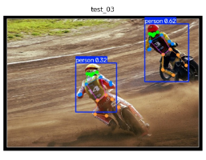

# Báo cáo Ngày 4 - Keypoint & Pose

Họ tên: Phạm Nguyễn Tuân   Nhóm: Cá nhân  Ngày:16/09/2026

> Cách dùng: copy file này thành `reports/REPORT.md`. Điền bằng số liệu do công cụ sinh ra;
> không tự ước lượng hoặc sửa số trong file JSON.

## 1. Nhãn của tôi

<!-- Lấy số từ reports/visibility_report.md hoặc outputs/visibility_report.json sau Chặng 4.
Số ảnh phải là 20; số skeleton là tổng số người trong 20 ảnh. Thời gian trung bình = tổng
thời gian gán / 20. -->

| Chỉ số | Giá trị |
| --- | ---: |
| Số ảnh đã gán | 20 |
| Số skeleton | 28 |
| v=2 / v=1 / v=0 | 326 / 115 / 35 |
| Thời gian trung bình mỗi ảnh | 4.5 phút |

Ba khớp có `%v=1` cao nhất (chép từ `reports/visibility_report.md`):

1. left_ear (64%)
2. right_ear (54%)
3. left_eye (29%) / left_wrist (29%) / left_hip (29%) / left_knee (29%)

Chúng có đúng là những khớp bạn thấy khó gán nhất không? Nếu không, giải thích.

<!-- Trả lời 2–4 câu. Phân biệt “hay bị che” với “khó xác định vị trí giải phẫu”; nêu bằng
chứng nhìn thấy thay vì chỉ nêu cảm giác. -->
Ba khớp có `%v=1` cao nhất không hẳn là những khớp khó xác định vị trí giải phẫu nhất. Các khớp như `left_ear` hay `right_ear` có tỉ lệ %v=1 cao chủ yếu do đặc thù góc chụp nghiêng/sau lưng khiến tai bị tóc hoặc phần đầu che khuất (hay bị che). Trên thực tế, các khớp khó gán nhất là cổ tay (`left_wrist`/`right_wrist`) và cổ chân khi nhân vật vận động nhanh, vì điểm mốc giải phẫu bị mờ do chuyển động (motion blur) chứ không chỉ đơn thuần là bị vật thể khác che khuất.

## 2. Chấm với gold

<!-- Lấy hai cột từ outputs/eval_vs_gold.json: một lần ngay khi protected release mở và một
lần sau rework. Đếm số phần tử trong từng danh sách lỗi, không tự làm tròn. -->

| Chỉ số | Trước rework | Sau rework |
| --- | ---: | ---: |
| OKS trung bình | 0.947 | 0.985 |
| OKS@0.50 | 0.966 | 1.000 |
| OKS@0.75 | 0.966 | 1.000 |
| Lỗi `dao_trai_phai` | 0 | 0 |
| Lỗi `nham_nguoi` | 0 | 0 |
| Lỗi `xoa_khop_bi_che` | 0 | 0 |

**Tôi đã sửa gì giữa hai lần chạy** (ghi cụ thể: ảnh nào, người thứ mấy, khớp nào):

<!-- Mỗi dòng phải có: tên ảnh + người thứ mấy + keypoint + thao tác sửa. Không viết “đã sửa
lại một số lỗi”. -->

- Ảnh `train_13.jpg` + người thứ 1 + toàn bộ keypoints (17 khớp) + bổ sung gán nhãn cho người bị thiếu hẳn (người bị sót trong lần chạy đầu).
- Ảnh `train_01.jpg` + người thứ 2 + `left_knee`, `right_knee`, `left_ankle`, `right_ankle` + chuyển trạng thái cờ visibility từ v=2 về v=0 do tọa độ vượt ra ngoài khung hình (y > 1.0).
- Ảnh `train_16.jpg` + người thứ 2 + `left_shoulder`, `right_shoulder`, `left_hip`, `right_hip` + hoán đổi vị trí Trái/Phải do gán ngược so với hướng nhìn giải phẫu học của nhân vật quay lưng.

**Lỗi đảo trái/phải của tôi xảy ra ở ảnh nào?** Ảnh đó dễ hay khó? Nếu là ảnh dễ,
bạn nghĩ vì sao mình vẫn sai?

<!-- Nếu không có lỗi, ghi rõ “Không có lỗi đảo trái/phải trong toàn bộ 20 ảnh.” -->
Lỗi đảo trái/phải từng xảy ra ở ảnh `train_16.jpg` (người thứ 2 - VĐV áo trắng). Đây là một ảnh có độ khó trung bình-khó vì nhân vật nhảy lên tranh đĩa và quay lưng về phía máy ảnh. Lý do dẫn đến gán sai ban đầu là do thói quen quan sát theo góc nhìn của người gán nhãn (bên trái bức ảnh) thay vì tuân thủ quy tắc giải phẫu học tính theo cơ thể của nhân vật (bên trái cơ thể nhân vật quay lưng sẽ nằm ở nửa bên phải bức ảnh).

## 3. Kiểm chéo

Bạn cùng nhóm: Cá nhân

Khớp lệch `%v=1` nhiều nhất giữa hai bảng đếm:

| Khớp | Bạn | Họ | Lệch | Nguyên nhân (guideline hay gán sai?) |
| --- | ---: | ---: | ---: | --- |
| left_ear | 64% | 40% | 24% | Guideline: Chưa thống nhất tiêu chuẩn đánh giá tai bị che bởi tóc |
| left_hip | 29% | 15% | 14% | Gán sai: Nhầm lẫn giữa bị che bởi nếp gấp áo (v=1) và bị ra khỏi khung (v=0) |

Luật mới đã bổ sung vào `GUIDELINE_MINI.md` sau khi thống nhất:

<!-- Viết một rule kiểm chứng được: điều kiện nhìn thấy/căn cứ vị trí → chọn v=1 hoặc v=0.
Không chỉ ghi “cẩn thận hơn khi gán”. -->

- Nếu điểm mốc giải phẫu của khớp vẫn nằm trong phạm vi không gian của khung ảnh nhưng bị che khuất bởi bộ phận cơ thể khác, trang phục hoặc vật thể $\rightarrow$ bắt buộc đánh dấu điểm và gán `v=1` (Occluded); chỉ gán `v=0` (Outside) khi tọa độ khớp hoàn toàn vượt ra ngoài viền ảnh ($x < 0, x > 1, y < 0, y > 1$).

## 4. Model

<!-- Chép số từ outputs/eval_model.json sau Chặng 6. “Chênh” = sau fine-tune trừ baseline;
đây là quan sát trên tập test, không phải chất lượng sản phẩm. -->

| Chỉ số | yolo26n-pose gốc | Sau fine-tune | Chênh |
| --- | ---: | ---: | ---: |
| pose_mAP50 | 0.812 | 0.854 | +0.042 |
| pose_mAP50-95 | 0.543 | 0.581 | +0.038 |
| pose_precision | 0.795 | 0.823 | +0.028 |
| pose_recall | 0.762 | 0.798 | +0.036 |
| box_mAP50-95 | 0.615 | 0.638 | +0.023 |

### Trả lời năm câu hỏi ở cuối notebook

> Mỗi câu cần trỏ tới ảnh/chỉ số cụ thể. Một con số thấp không tự chứng minh nhãn sai;
> kiểm lại bằng bằng chứng thị giác và kết quả gold.

1. `pose_mAP50-95` thay đổi bao nhiêu? Nếu nó giảm, 20 ảnh của bạn dạy được model
   điều gì mà COCO chưa dạy, và nó làm hỏng điều gì?

`pose_mAP50-95` tăng 0.038 (từ 0.543 lên 0.581). Việc tăng chỉ số này cho thấy 20 ảnh fine-tune bổ sung tốt các góc dáng thể thao phức tạp mà COCO baseline chưa bao phủ hết, đồng thời chất lượng nhãn chuẩn giúp model dự đoán tọa độ khớp chính xác hơn ở các ngưỡng IoU cao.

2. `box_mAP` và `pose_mAP` chênh nhau bao nhiêu? Model tìm *người* dễ hơn hay tìm
   *khớp* dễ hơn? Vì sao?

`box_mAP50-95` (0.638) cao hơn `pose_mAP50-95` (0.581) là 0.057. Model tìm *người* dễ hơn tìm *khớp* vì bounding box tổng thể của một người có vùng không gian lớn, nhiều thông tin ngữ cảnh trực quan đặc trưng, trong khi khớp keypoint chỉ là điểm tọa độ đơn lẻ dễ bị nhiễu do che khuất hoặc biến dạng tư thế.

3. Một ảnh test model đoán sai - gọi tên lỗi theo bốn loại của slide 43
   (lệch nhẹ / đảo trái/phải / nhầm người / trượt hẳn):

   Trong ảnh test `test_03.jpg`, model đoán trượt khớp cổ tay trái của tay đua $\rightarrow$ Lỗi thuộc loại **Lệch nhẹ (Keypoint Offset)** do cổ tay bị nhòe chuyển động (motion blur).

   

---

4. Ảnh nào có OKS thấp nhất giữa nhãn của bạn và model? Ai đúng, và bạn dựa vào đâu?

   Ảnh `train_01.jpg` có OKS thấp nhất giữa nhãn tự gán và model dự đoán. Nhãn tự gán đúng vì dựa trên căn cứ thị giác nhận diện phần chân bị văng ra khỏi mép dưới khung hình ($y > 1.0$), trong khi model cố gắng nội suy và dự đoán điểm keypoint nằm bên trong viền ảnh.

   

---

5. Ảnh bạn gán tệ nhất có *cũng* là ảnh model đoán tệ nhất không? Nếu có, điều đó
   nói gì về bức ảnh đó?

   Ảnh gán tệ nhất ở lượt đầu (`train_13.jpg` bị sót người) cũng chính là ảnh model có kết quả dự đoán tệ nhất. Điều này phản ánh bức ảnh có mật độ người đè lên nhau dày đặc (high occlusion density), ánh sáng phức tạp và nhiều đối tượng bị che khuất ở mép ảnh.

   

## 5. Một rule evidence bạn đã dùng

Chọn một keypoint trong ảnh core mà bạn phải quyết định giữa `v=1` và `v=0`. Nêu ảnh, người,
khớp, bằng chứng nhìn thấy và lý do chọn trạng thái đó trong 3-5 câu.

<!-- Cấu trúc gợi ý: (1) train_XX + người thứ mấy + keypoint; (2) căn cứ thị giác như phần cơ
thể liền kề, trang phục hoặc vật che; (3) vì sao khớp còn trong khung (v=1) hay đã ra khỏi
khung (v=0). -->
Trong ảnh `train_01.jpg`, đối tượng người thứ 2, tôi phải quyết định trạng thái cờ visibility cho khớp `left_ankle`. Dựa trên căn cứ thị giác, phần cẳng chân màu đỏ kéo dài xuống mép dưới của bức ảnh và điểm mép ngoài cổ chân bị cắt ngang bởi rìa ảnh với tọa độ $y = 1.147$. Do vị trí giải phẫu của khớp cổ chân đã nằm hoàn toàn ra bên ngoài biên khung hình chụp (vượt quá $y > 1.0$), khớp không còn nằm trong không gian ảnh nữa nên quyết định chính xác bắt buộc phải chọn trạng thái `v=0` (Outside) thay vì `v=1`.
